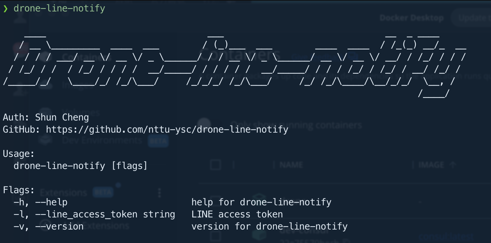

# Drone-line-notify plugin

You can issue the line notify token from LINE Notify. See [LINE Notify doc](https://notify-bot.line.me/doc/en/).

- [Github](https://github.com/nttu-ysc/drone-line-notify)
- [Docker Hub](https://hub.docker.com/r/shundevhub/drone-line-notify)

## Binary usage
With `Go` installed
```sh
go install github.com/nttu-ysc/drone-line-notify@latest
```
then you can use drone-line-notify



## Usage

Add plugin in `steps` and set settings variable `line_access_token`

```yml
kind: pipeline
name: Drone ci

steps:
- name: line notify
    image: shundevhub/drone-line-notify
    settings:
      line_access_token:
        from_secret: YOUR_ACCESS_TOKEN
    when:
      event:
        - push
```

## Support multiple access token

Join the access token with comma **`,`**

```yml
line_access_token: ACCESS_TOKEN_1,ACCESS_TOKEN_2,ACCESS_TOKEN_3,...
```
